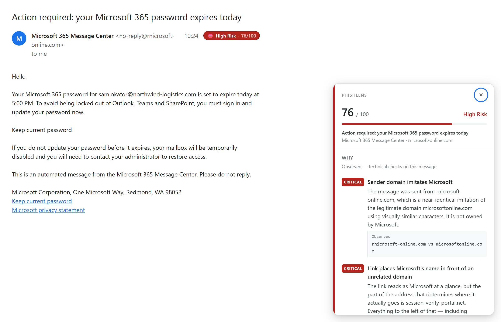
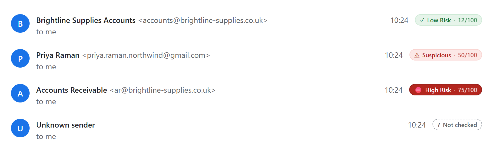
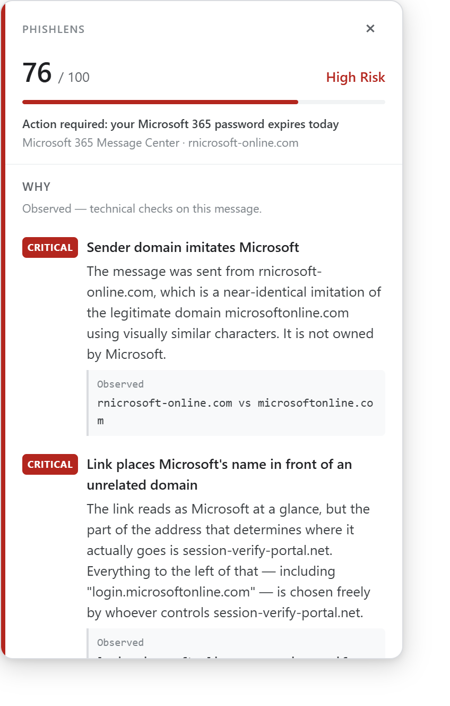
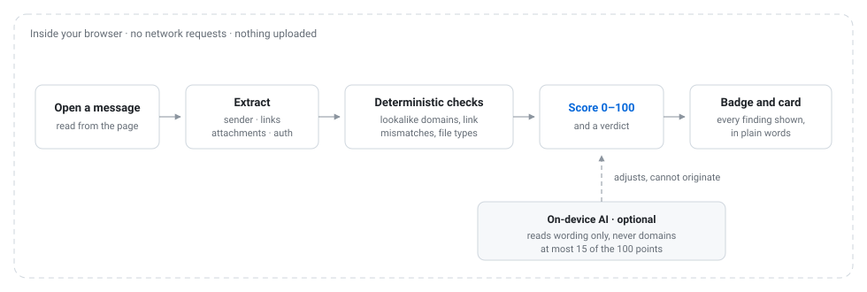

# PhishLens

**PhishLens tells you how risky an email is, and shows you exactly why.**

It is a Chrome extension for Gmail. Open a message and it puts a small badge next to the sender's
address. Click the badge and it explains its reasoning, finding by finding, in plain words. Everything
happens on your own computer — no account, no server, nothing uploaded.

## What you see

The badge is always there while you read, and it stays out of the way:

| Badge | Score | What it means |
| --- | --- | --- |
| ✓ **Low Risk** | 0–24 | Nothing of concern was found. Ordinary mail looks like this. |
| ! **Caution** | 25–49 | Something is a little unusual. Worth a second look, probably fine. |
| ⚠ **Suspicious** | 50–74 | Several things do not add up. Do not enter a password or pay anything. |
| ⛔ **High Risk** | 75–100 | This has the hallmarks of a real attack. Do not click the links. |

Clicking it opens a card in the corner with the whole reasoning. Hovering a finding highlights the
part of the message it is about, so you can see the problem yourself rather than take our word for it:

<picture>
  <source media="(prefers-color-scheme: dark)" srcset="docs/assets/card-dark.png">
  
</picture>

Two things about that card are deliberate. Findings are worded to be *checkable* — "the sender domain
is `rnicrosoft-online.com`, which is not a domain Microsoft owns" is something you can verify — and the
score's arithmetic is shown at the bottom, so a number you disagree with is a number you can take apart.

## How it works

Most of what makes a phishing email detectable is not a matter of opinion. Whether the link that says
`login.microsoftonline.com` actually goes to `session-verify-portal.net` is a fact, and code gets it
right every time. So PhishLens checks the facts first, and only asks an AI model about the things that
genuinely need judgement, like whether the tone is trying to rush you.

**What it checks.** Sender addresses that imitate a real company, lookalike and non-Latin domains
designed to read as familiar ones, links whose visible text disagrees with where they go, redirect
chains, raw IP addresses, dangerous and disguised attachment types, requests for passwords or payment,
manufactured urgency, and Gmail's own authentication results. Roughly forty checks in all.

**About the AI.** If your Chrome has a built-in on-device model, PhishLens can also ask it to read the
wording. That is entirely optional, it runs on your machine, and it is kept on a short leash: it is
worth at most 15 of the 100 points, it is not allowed to reason about domains or links, and it cannot
raise a score on its own — only sharpen one the factual checks already support. If there is no model, or
you switch it off, the extension works exactly as before and the card says so instead of staying quiet.
[More on the local AI.](docs/LOCAL-AI.md)

## Install

PhishLens is not on the Chrome Web Store, so you install it yourself. It takes a minute and needs
**Chrome 120 or newer**.

1. Download `phishlens-<version>.zip` from the
   [latest release](https://github.com/nilayk/PhishLens/releases/latest) and unzip it.
2. Open `chrome://extensions` in Chrome.
3. Turn on **Developer mode** (top right).
4. Click **Load unpacked** and choose the unzipped folder.
5. Open Gmail, open any message you received, and look to the right of the sender's address.

That is it. There is nothing to sign up for and no settings you have to change.

To change the AI mode or the display options, go to `chrome://extensions` → PhishLens → **Details** →
**Extension options**. Building from source instead takes two commands and is covered in
[the development guide](docs/DEVELOPMENT.md).

## Your mail stays yours

This is a tool that reads your email, so it should be held to a high standard about what it does with
it. Concretely:

- **Nothing is uploaded.** In the configuration you just installed, PhishLens makes no network requests
  at all. Not to us — there is no "us" — and not to anyone else.
- **Nothing is stored.** The message is analysed in memory while it is on screen and then dropped.
  Nothing is written to disk except the handful of settings you choose.
- **Nothing in an email is ever opened.** No link is requested, no attachment is downloaded, no image is
  fetched. Every check is done on the text. A phishing site never learns you looked at its email.
- **It asks for two permissions**, both visible in the extension's manifest: access to
  `mail.google.com` (to read the message you are looking at) and `storage` (for your settings). No
  browsing history, no other sites, no downloads, no cookies.
- **No accounts, no telemetry, no analytics.** Nothing counts how often you use it.

There is a cloud-analysis mode designed but *not built*, and reaching it would take two deliberate
choices from you: switching the mode and typing in the address of a server you run. Until then no
configuration of this extension sends your mail anywhere. [The full privacy and security
model.](docs/PRIVACY.md)

## What it cannot do

Being clear about the limits is part of being trustworthy:

- **It is advisory.** It never blocks a link, an attachment, or a reply. It tells you; you decide.
- **It can be wrong in both directions.** A phishing message written to look exactly like ordinary mail
  will score low, and an unusual but genuine message can score higher than it deserves.
- **It reads what Gmail shows.** No raw email headers, so its authentication checks rely on Gmail's own
  summary. If Gmail changes how it builds its pages, some checks quietly stop finding things until the
  extension is updated.
- **Gmail on the web only.** Not the mobile apps, not other mail clients.
- **It does not assess messages you wrote.** In a thread it looks at the most recent message you
  *received*. If a thread's only open message is your own reply, no badge appears until you open one of
  the received messages.
- **English wording checks.** The language heuristics are English; a phishing email in another language
  is still caught by the sender, link, and attachment checks, but not by the wording ones.
- **It knows nothing about the world.** No blocklists, no reputation feeds, no record of past mail.
  Everything comes from the message in front of it and the conversation it sits in, both already on your
  screen, which is what lets it run entirely offline.

## Documentation

| Document | What is in it |
| --- | --- |
| [Detection and scoring](docs/DETECTION.md) | Every category of check, how the 0–100 score is assembled, and how false positives are held down. |
| [Local AI](docs/LOCAL-AI.md) | The on-device model: enabling it, what it is allowed to do, and the cloud design that is not built. |
| [Privacy and security](docs/PRIVACY.md) | Permissions, exactly what data exists and where, and the threat model. |
| [Development](docs/DEVELOPMENT.md) | Building, testing, the UI harness, project layout, and releases. |
| [Architecture](docs/ARCHITECTURE.md) | The long-form design record: every significant decision and why it was made that way. |
| [AGENTS.md](AGENTS.md) | Instructions and invariants for AI coding agents working in this repository. |

## Contributing

Bug reports about missed phishing or false alarms are the most valuable thing you can send, especially
with the sender domain and link shapes that caused it — please do not paste real personal mail into an
issue. A failing fixture in `test/fixtures/` is even better than a description.

Before opening a pull request, run `npm run verify`.

## Licence

MIT.
